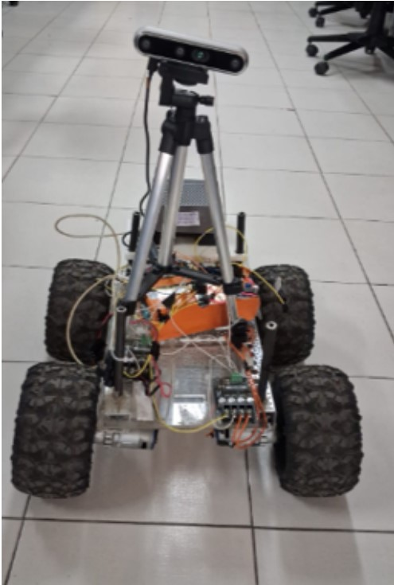
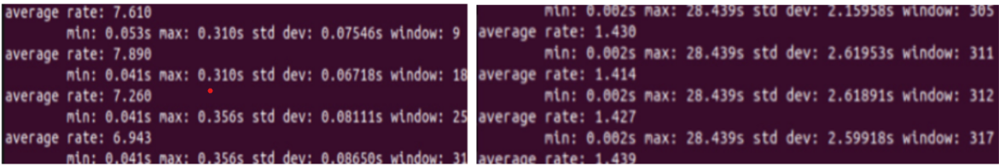

# Autonomous Ground Rover: Edge-AI Perception & Control 🚀

A custom-built, differential-drive autonomous rover powered by an NVIDIA Jetson AGX Orin. This project implements a zero-copy intra-process communication (IPC) pipeline to run heavy vision and depth models concurrently on a single edge GPU, enabling real-time pedestrian tracking and obstacle avoidance.
<video src="assets/tracking_demo.mp4" autoplay loop muted playsinline width="100%"></video>
*Figure 1: Complete perception pipeline running Depth Anything V2 and a DETR detector concurrently on the Jetson AGX Orin, tracking dynamic targets via a spatial tracking node.*
## 🧠 System Architecture

This repository contains the ROS 2 and hardware control stack for the rover, bridging high-level semantic understanding with low-level motor actuation.

*   **Zero-Copy IPC Pipeline:** Utilizes NVIDIA Isaac ROS NITROS within a Docker-containerized environment to share GPU memory buffers. This allows concurrent execution of **Depth Anything V2** (7-8 FPS) and a **DINO Swin-L** detector (1-2 FPS) without frame drops.
*   **Asynchronous Sensor Fusion:** Features a custom C++ time-synchronizer node that perfectly fuses asynchronous inference streams. It locks depth median values to dynamically cropped pedestrian bounding boxes using exact timestamp matching, allowing for robust background exclusion.
*   **Differential Drive Control:** A Python-based proportional controller translates live spatial offsets and depth maps into real-time PWM steering commands.
*   **Microcontroller Integration:** Serial commands are dispatched via an asynchronous queue to an ESP32, which drives the motor controllers. 

## 🛠️ Hardware Stack

The physical rover was designed and fabricated from scratch with a focus on stable power delivery and safety:

*Figure 2: Custom fabricated differential-drive chassis highlighting the isolated compute and motor power rails.*
*   **Compute:** NVIDIA Jetson AGX Orin
*   **Microcontroller:** ESP32
*   **Sensors:** Intel RealSense D455i Depth Camera
*   **Motor Drivers:** MD20A Motor drivers
*   **Power Delivery:** Custom-designed isolated power rails separating compute and motor domains. This ensures the Jetson receives stable, uninterrupted voltage from external power bank, preventing brownouts during heavy motor draw.
*   **Hardware Safety Layer:** Integrated a 1-second hardware watchdog timer and a 10 Hz heartbeat signal. If the camera stream drops or the IPC pipeline disconnects, the ESP32 immediately halts the motor drivers to prevent runaway scenarios.

## 📦 Software Dependencies

*   Ubuntu / Linux
*   ROS 2 (Humble)
*   Docker & NVIDIA Container Toolkit
*   NVIDIA Isaac ROS (NITROS)
*   TensorRT

## 🚀 Getting Started

### 🔌 ESP32 Microcontroller Setup

The edge compute board communicates with the physical motor drivers via an ESP32. You must flash the firmware to the microcontroller before running the ROS 2 pipeline.

1. Open the Arduino IDE.
2. Load the `Rover_esp32_control/depth_JRD301.ino` sketch.
3. Ensure your board manager is set to your specific ESP32 module.
4. Verify the baud rate in the sketch matches the serial configuration in your custom ROS 2 control node (default is 115200).
5. Connect the ESP32 via USB and click **Upload**.

### 🐳 Containerized Environment Setup

This project relies on the NVIDIA Isaac ROS hardware-accelerated ecosystem. To ensure reproducibility and avoid dependency conflicts, the entire pipeline is designed to run inside a Docker container.

**Prerequisites:**
Before cloning this repository, ensure your host machine (Jetson AGX Orin) has the following installed:
1. Ubuntu 20.04 or 22.04
2. Docker & NVIDIA Container Toolkit

**Step 1: Set up the Isaac ROS Development Environment**
Please follow the official NVIDIA documentation to configure your base Docker environment. This will guide you through installing the `isaac_ros_common` tools needed to spin up the container.
> 🔗 [Official NVIDIA Isaac ROS Developer Environment Setup Guide](https://nvidia-isaac-ros.github.io/getting_started/index.html)

**Step 2: Launch the Container**
Once your environment is configured, use NVIDIA's run script to launch the interactive Docker container:
```bash
# Navigate to the Isaac ROS common tools directory
cd ~/workspaces/isaac_ros-dev/src/isaac_ros_common

# Launch the container attached to your workspace
./scripts/run_dev.sh -d ~/workspaces/isaac_ros-dev
```
**Step 3: Install Dependencies & Clone the Repository**
```bash
# Navigate to the workspace source directory
cd /workspaces/isaac_ros-dev/src

# Update package lists and install required Isaac ROS packages
sudo apt-get update
sudo apt-get install -y ros-humble-isaac-ros-image-proc ros-humble-isaac-ros-dnn-image-encoder ros-humble-isaac-ros-tensor-rt
# Install Python serial library for ESP32 communication
sudo apt install -y python3-serial
# 1. Clone the Repository
git clone https://github.com/Vedant-Singh-bgr/Autonomous_Ground_Rover.git
cd /workspaces/isaac_ros-dev
```
**Step 4: Pre-Compiled Model Setup**
> ⚠️ **Important Hardware Note:** The model weights provided below are pre-compiled TensorRT engines (`.trt`). Because TensorRT optimizes specifically for the host architecture, these files will **only execute on an NVIDIA Jetson AGX Orin**. 

1. Download the pre-compiled engines for both perception models:
   - [Depth Anything V2 TRT](https://drive.google.com/file/d/1VHyzrP2WtM3fekn0JIxg_vH4xQydNHTp/view?usp=sharing)
   - [DETR TRT](https://drive.google.com/file/d/1Fg1wJ09oUOO5yoqZiScSKCLYW6DrcPJD/view?usp=sharing)
2. Place both `.trt` files directly into the `isaac-ros-pedestrian-follower/models/` directory.
3. Ensure your launch file is correctly pointing to these engine files.

*(Note: If you are evaluating this pipeline on a different GPU architecture, you will need to supply your own `.onnx` weights and compile them locally.)*
**Step 5: Build & Launch**
```bash
# Build only the relevant packages 
colcon build --packages-up-to rover_perception custom_rover_nodes
#Source the newly built environment
source install/setup.bash
# Launch the zero-copy perception pipeline
ros2 launch rover_perception rover_perception.launch.py
```
## 📈 Performance & Optimization

By exporting the underlying models to ONNX and compiling them into highly optimized TensorRT engines, the system maximizes the AGX Orin's hardware accelerators. The NITROS pipeline ensures that image tensors remain on the GPU memory throughout the entire perception phase, completely eliminating CPU-GPU memory copy bottlenecks.

## 📊 Benchmarks & FPS

The zero-copy IPC pipeline ensures maximum throughput on the edge. Below are the real-world inference speeds measured on the physical rover during active tracking:

| Model | Task | Input Resolution | Hardware Accelerator | Real-World FPS |
| :--- | :--- | :--- | :--- | :--- |
| **Depth Anything V2** | Monocular Depth Estimation | 518x518 | Jetson AGX Orin (TensorRT) | **7 - 8 FPS** |
| **DETR (DINO Swin-L)** | Pedestrian Detection | 640x640 | Jetson AGX Orin (TensorRT) | **1 - 2 FPS** |


*Figure 3: Real-time ROS 2 topic frequency (Hz) logs proving asynchronous execution. The left terminal monitors the depth node maintaining ~7-8 FPS, while the right terminal logs the heavier DETR perception node running concurrently at ~1.4 FPS without bottlenecking the system.*
